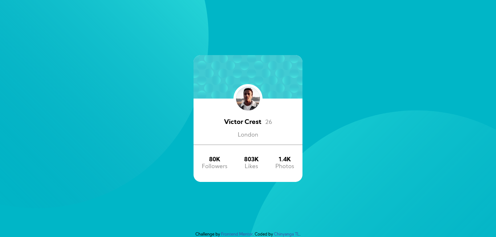
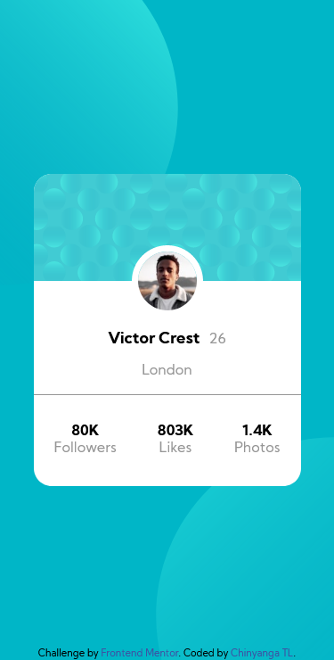

## Table of contents

- [Overview](#overview)
  - [The challenge](#the-challenge)
  - [Screenshot](#screenshot)
  - [Links](#links)
- [My process](#my-process)
  - [Built with](#built-with)
- [Author](#author)

## Overview

### The challenge

- Build out the project to the designs provided

### Screenshot

 - Screenshot of solution. 

 - Screenshot of mobile view of solution. 

### Links

- Solution URL: [https://chinyangatl.github.io/profile-card-component.github.io/]
- Live Site URL: [https://chinyangatl.github.io/profile-card-component.github.io/]

## My process

### Built with

- Semantic HTML5 markup
- CSS custom properties
- Flexbox

## Author

- Website - [Chinyanga TL](https://github.com/beyonce-beytwice)
- Frontend Mentor - [@yourusername](https://www.frontendmentor.io/profile/beyonce-beytwice)

